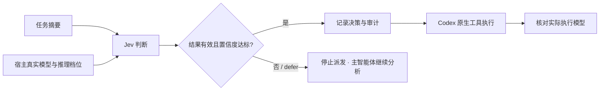

<div align="center">

# Jev Codex Router

### 让 Jev 选择模型，让 Codex 专注执行。

按任务需求选择 **模型 × 推理强度**，把路由流程装进一个可分享的 Codex Skill。

[](https://github.com/455-dIAO/jev-codex-router-skill/releases/latest)
[](https://github.com/455-dIAO/jev-codex-router-skill/actions/workflows/platform-validation.yml)


[**下载安装包**](https://github.com/455-dIAO/jev-codex-router-skill/releases/latest) · [**快速开始**](#quick-start) · [**工作原理**](#how-it-works) · [**验证记录**](VALIDATION.md)

</div>

---

不同任务需要不同的推理投入。这个 Skill 将当前宿主支持的模型和推理档位整理为候选，由 Jev 判断任务需求，再由 Codex 使用选定配置执行适合独立完成的子任务。

| 按需选择 | 轻量安装 | 结果可核对 |
| :--- | :--- | :--- |
| 从真实可用的模型与档位中选择 | Python 标准库，无需额外 pip 依赖 | 返回置信度、决策 ID 和本地审计记录 |
| 用户指定的模型与预算优先 | 安装器不改现有模型配置或 Hooks | 分别说明选模结果与实际执行证据 |

> [!IMPORTANT]
> **桌面版：给独立子任务选模。macOS CLI：可按指南另行接入原项目的逐轮路由。**
> 安装本 Skill 不会自动切换桌面主会话模型，也不会自动拦截每条消息。

<a id="quick-start"></a>

## 🚀 快速开始

### 1 · 安装 Skill

从 [Releases](https://github.com/455-dIAO/jev-codex-router-skill/releases/latest) 下载 ZIP，解压后在包含 `install.py` 的目录运行：

```sh
python install.py
```

Windows 可使用 `py -3 install.py`；macOS / Linux 可使用 `python3 install.py`。

<details>
<summary><strong>其他安装方式：Git 克隆、自定义目录、手动复制</strong></summary>

**从 GitHub 克隆：**

```sh
git clone https://github.com/455-dIAO/jev-codex-router-skill.git
cd jev-codex-router-skill
python install.py
```

**指定 Skills 目录：**

```sh
python install.py --skills-dir /your/custom/skills
```

**手动安装：** 将完整的 `jev-codex-router` 文件夹复制到当前用户的 Skills 目录。

默认位置为 `$CODEX_HOME/skills/jev-codex-router`；未设置 `CODEX_HOME` 时使用 `~/.codex/skills/jev-codex-router`。

</details>

### 2 · 配置自己的 Jev 凭据

将所选提供方的 Key 配置到 **Codex 进程能读取的环境变量**中：

| 提供方 | 环境变量 |
| :--- | :--- |
| OpenRouter | `OPENROUTER_API_KEY` |
| TypeSafe | `JEV_API_KEY` 或 `TYPESAFE_API_KEY` |

不要把 Key 写入 Skill 或提交到仓库。每次实时选模会将任务摘要与候选描述发送到所选提供方，可能产生 API 费用。环境变量设置后，已运行的 Codex 可能需要重启才能读取。

### 3 · 在 Codex 中开始使用

打开新会话，复制这段提示词：

```text
使用 $jev-codex-router 帮我配置 Jev 模型路由。
先检查当前宿主支持的执行方式，从真实模型目录生成候选配置。
使用我已配置的提供方凭据，为一个只读小任务做实时选模验证。
报告决策 ID、置信度、选定模型和推理强度，
并分别说明子任务是否执行、实际模型是否得到验证。
```

Skill 会引导 Codex 生成适合你当前环境的配置，**不需要照搬其他人的模型名称**。

<a id="how-it-works"></a>

## 🧭 工作原理



Jev 负责选择，Codex 负责执行。路由脚本返回结构化参数，不会自行创建智能体。宿主必须支持显式传入模型与推理强度，才能真正采用选定配置。

### 两种接入方式

| | 桌面原生子智能体 | macOS Codex CLI |
| :--- | :--- | :--- |
| **路由对象** | 适合独立执行的子任务 | 每轮用户消息 |
| **运行方式** | 本包选择器 + 宿主原生派发工具 | 另行安装上游运行时 |
| **前提** | Python 3.10+；宿主允许显式选模 | macOS、已登录的 Codex CLI、Jev Key |
| **使用指南** | [配置与验证](jev-codex-router/references/configuration.md) | [上游接入指南](jev-codex-router/references/upstream-macos.md) |

> [!NOTE]
> 没有显式选模接口时，结果只能作为建议。本包已完成 Windows 桌面子任务实际模型核验，以及 Ubuntu / macOS 的安装与离线路由测试。macOS 上游 CLI 的登录和逐轮路由是另一条链路，仍需另行验证。

## 🔎 验证状态

以下为 **2026-09-22 的验证快照**。v1.0.1 补充跨平台测试和验证记录，安装器与路由脚本保持 v1.0.0 的实现；顶部 Platform validation 徽章显示最新工作流状态。

| 检查项 | 结果 |
| :--- | :--- |
| Skill 格式校验 | ✅ 通过 |
| Windows 离线回归测试 | ✅ 16 项通过；1 项因链接创建权限跳过 |
| ZIP 解压后首次安装与重复安装 | ✅ 通过 |
| OpenRouter 实时选模 | ✅ 一次合成任务成功，置信度 1.0 |
| 桌面子任务实际执行模型 | ✅ 本包选模 → 原生派发 → 完成；执行记录确认 `gpt-5.6-luna / low` |
| TypeSafe 官方账户直连 | ✅ 使用本机账户环境凭据，真实调用成功，置信度 1.0 |
| Ubuntu / macOS 系统运行 | ✅ GitHub 托管系统，Python 3.10 / 3.12 四组各 17 项通过；另有 Ubuntu WSL 验证 |
| 上游 macOS CLI 登录与逐轮路由 | ⏳ 未验证；跨平台离线测试不包含这条链路 |
| v1.0.0 完整 Skill 独立审查 | ⏸ 当时因 Jev 低置信度未派发；本轮验证不替代完整审查 |

[查看完整验证记录 →](VALIDATION.md) · [查看 macOS / Linux 测试运行 →](https://github.com/455-dIAO/jev-codex-router-skill/actions/runs/35697914357)

<details>
<summary><strong>自己运行离线测试或核对下载文件</strong></summary>

在仓库或分发包根目录运行，不需要 API Key：

```sh
python -m unittest discover -s tests -v
```

Release 附带 `.zip.sha256` 文件。Windows PowerShell 可运行下面的命令，将结果与校验文件中的值比较：

```powershell
Get-FileHash .\jev-codex-router-skill-v1.0.1.zip -Algorithm SHA256
```

</details>

## 📚 文档导航

| 文件 | 内容 |
| :--- | :--- |
| [SKILL.md](jev-codex-router/SKILL.md) | Codex 加载的 Skill 入口与执行规则 |
| [配置与使用](jev-codex-router/references/configuration.md) | 提供方、模型候选、输入输出与验收步骤 |
| [macOS 上游接入](jev-codex-router/references/upstream-macos.md) | 原项目的安装、配置与卸载 |
| [配置模板](jev-codex-router/assets/router.example.json) · [任务模板](jev-codex-router/assets/task.example.json) | 由 Codex 按当前环境补全的起始文件 |
| [路由脚本](jev-codex-router/scripts/route.py) | 选择、响应校验与审计实现 |
| [来源与边界](jev-codex-router/references/sources.md) | 原理来源、API 文档与实现说明 |

## 常见问题

<details>
<summary><strong>安装后找不到 Skill？</strong></summary>

先打开新的 Codex 会话，必要时重启应用。确认安装目录属于当前用户及当前 `CODEX_HOME`，再输入 `$jev-codex-router`。

</details>

<details>
<summary><strong>重复安装会覆盖我的配置吗？</strong></summary>

安装器只复制八个必要文件，不联网、不读取 Key，不修改 Hooks、`AGENTS.md` 或已有模型配置。相同内容返回 `already_installed`；已有内容不同时停止覆盖。需要更新时，先备份旧 Skill 目录和个人改动。

</details>

<details>
<summary><strong>安装后会自动给所有任务切换模型吗？</strong></summary>

不会。本 Skill 没有后台服务或自动 Hook。桌面模式下，Codex 在合适的独立子任务上调用选择器，再通过宿主支持的工具派发。若需要 macOS CLI 每轮消息自动路由，请按上游接入指南另行配置。

</details>

<details>
<summary><strong>怎么卸载？</strong></summary>

确认安装路径并备份个人改动后，只移除 Skills 目录中的 `jev-codex-router` 文件夹。工作目录内的配置、审计，以及独立安装的上游运行时不会随之删除。

</details>

---

<div align="center">

原理参考 [gholtzap/jev-codex-model-and-effort-router](https://github.com/gholtzap/jev-codex-model-and-effort-router)

社区独立实现 · 非 TypeSafe、OpenAI 或上游官方产品 · 不承诺固定额度节省或任务成功率

</div>
